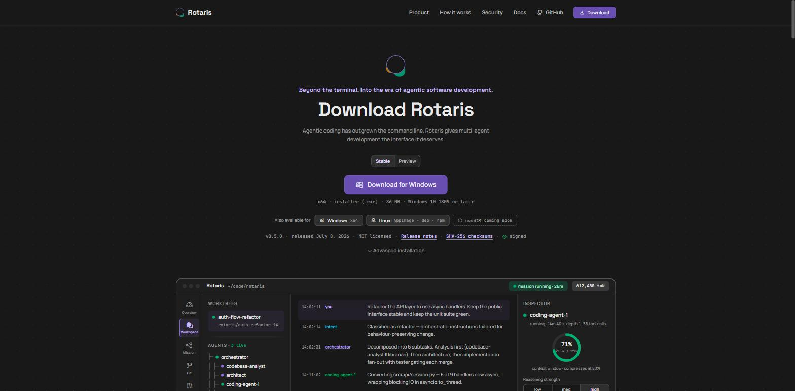

<div align="center">


# Rotaris website

Marketing and download site for **Rotaris**, the desktop control plane for
running and supervising a team of specialized coding agents.



React · Vite · TypeScript · nginx · Portainer behind Traefik

</div>

---

## Development

```bash
npm install
npm run dev
```

| Script      | Does                                       |
| ----------- | ------------------------------------------ |
| `dev`       | Vite dev server on port 5173               |
| `build`     | Typecheck, then emit the production bundle |
| `preview`   | Serve `dist/` locally                      |
| `typecheck` | Typecheck only                             |
| `check:anchors` | Assert every `HOME_ANCHORS` entry has a matching section id |

## Layout

```
src/
  components/   one file per homepage section, in page order
  pages/        Home, the legal pages, NotFound
  legal/        the published legal documents, as Markdown
  i18n/         locale config and the English and German catalogues
  data/         release metadata and route paths
  hooks/        platform detection, channel state, reduced motion
  styles/       design-system tokens and primitives, then page composition
```

`styles/tokens/`, `base.css`, `components.css` and `motif.css` come verbatim
from the Rotaris design system. Treat them as vendored — change the design
system first, then re-sync. Page styling belongs in `site.css`.

Release version, artifact sizes and per-platform availability live in
[`src/data/release.ts`](src/data/release.ts). A release bump touches that file
and nothing else.

## Languages

English is the default and lives at `/`; German lives under `/de`. The prefix is
the whole of the language state — a first-time visitor whose browser asks for
German is redirected from `/` to `/de` once per page load, and `/en` is the
explicit English URL for anyone who wants to override that.

**Nothing is persisted.** No cookie, no `localStorage`, no `sessionStorage` —
the privacy page tells visitors this site uses none, and that has to stay true.
`i18next-browser-languagedetector` is deliberately *not* wired in, because it
caches to `localStorage` by default. If a stored preference is ever wanted, the
privacy page changes in the same commit.

Copy lives in [`src/i18n/locales/`](src/i18n/locales/), split into three
namespaces: `common` (nav, footer, 404), `home` (the homepage sections) and
`legal` (the chrome around the legal documents). Both locales are bundled rather
than fetched, so no frame ever renders the wrong language.

Two things stay in English on purpose: the workspace mock-up in
`WorkspaceMock.tsx`, which depicts the application, and the agent, tool, persona
and branch names throughout — those are identifiers the product uses verbatim.

Adding a locale means `src/i18n/config.ts`, a new folder under `locales/`, the
`LOCALES` list in `vite.config.ts`, the route regex in `nginx.conf`, and the
smoke-test route list in both workflows.

## Legal pages

| Route             | Document                          | German slug                              |
| ----------------- | --------------------------------- | ---------------------------------------- |
| `/imprint`        | Impressum                         | `/impressum`                             |
| `/privacy`        | Datenschutzerklärung              | `/datenschutz`, `/datenschutzerklaerung` |
| `/terms`          | AGB — Rotaris Cloud               | `/agb`                                   |
| `/eula`           | Endnutzerbedingungen              | `/endnutzerbedingungen`                  |
| `/withdrawal`     | Widerrufsbelehrung                | `/widerruf`, `/widerrufsbelehrung`       |
| `/acceptable-use` | Richtlinie zur zulässigen Nutzung | `/nutzungsrichtlinie`                    |

Every row exists under `/de` as well, slugs included: `/de/impressum` redirects
to `/de/imprint`, not out of the locale.

The Markdown in [`src/legal/`](src/legal/) is copied from the company legal
package, which is the canonical source and lives elsewhere. **To update a
document, replace the file** — editing the text here makes the two drift, and
the reviewed copy is the other one. Sections the package marks as internal are
removed on import; the renderer strips them again as a safety net.

The documents stay in German **in both locales**. That is the contract language
for the offering they cover, and a translated withdrawal notice would be a
second wording readable against the first. Only the chrome around them — title,
back link, draft banner, the intro cards — follows the site language, and the
English page says outright why the document below it is not in English. The
Impressum body is German for the same reason: its required wording is statutory.

The one translated item near them is the "this website" card on `/privacy`,
which is this site's own privacy statement rather than part of the package. The
English rendering carries a note that the German one is authoritative.

`[PRÜFEN]` and `[PLATZHALTER]` markers render as amber `OFFEN` boxes and are
counted in each page's draft banner. They are the sentences that are not yet
true, and they block publication.

The Impressum is built from data in
[`src/pages/Imprint.tsx`](src/pages/Imprint.tsx) rather than copied, because the
package ships findings about the existing imprint rather than a replacement.

## Crawlers

`robots.txt` and `sitemap.xml` are generated at build time from `SITE_URL`, the
same value that stamps the canonical and Open Graph tags. Everything is allowed
for every user agent.

The sitemap lists every route once per locale, and each entry carries
`hreflang` alternates for both plus `x-default`, so the two language versions
read as one page rather than as duplicates. The canonical and `hreflang` tags in
the document head are set per route by
[`src/hooks/usePageMeta.ts`](src/hooks/usePageMeta.ts) — `index.html` can only
carry one canonical, and a static one would claim the homepage for every route.

The Open Graph card at `public/og-image.png` is generated, not drawn:

```bash
python scripts/og-image.py
```

It builds the mark from `src/assets/logo.svg` and the greys from the oklch
values in `src/styles/tokens/colors.css`, so re-run it after a brand change
rather than editing the PNG.

Unknown paths return a real 404 carrying the designed 404 page. nginx therefore
needs to know the client-side routes: the list lives in both `nginx.conf` and
`src/data/routes.ts`, and CI checks they agree.

## Container

```bash
docker build -t rotaris-website:local .
docker run --rm -p 8080:8080 rotaris-website:local
```

Runtime is `nginx-unprivileged` on port 8080 as uid 101, with a read-only root
filesystem and a health probe at `/healthz`.

## Deployment

```
push to main  ->  build image  ->  push to GHCR  ->  smoke test
              ->  POST the Portainer stack webhook  ->  redeploy
```

**1. Create the stack.** Portainer, Stacks, Add stack, Repository. Point it at
this repository, compose path `docker-compose.yml`, load variables from
`.stack.env`, and enable the webhook under automatic updates.

**2. Add the secret.** `PORTAINER_WEBHOOK_URL`, set to the webhook URL from step
one. Anyone holding that URL can trigger a redeploy, so it belongs in Actions
secrets rather than in the repository.

Publishing to GHCR uses the built-in `GITHUB_TOKEN`. The package is created
private on first push, so make it public or add a pull secret in Portainer
before the host can pull it.

**3. Set `SITE_URL`.** An Actions *variable*, not a secret. It stamps the
canonical URLs and the sitemap, and switches on the post-deploy check that polls
the live site.

**4. Point `TRAEFIK_RULE` at the hostname.** Everything else in `.stack.env`
matches the proxy this stack sits behind. Every value also has a default in
`docker-compose.yml`, so the stack still comes up if Portainer is not reading
the env file.

### Basic auth

An optional Traefik gate in front of the whole site, for the period before
launch.

```
BASIC_AUTH=true
BASIC_AUTH_USERS=admin:$2y$05$...
```

Generate the value with the helper, which prints it ready to paste:

```bash
./scripts/basic-auth.sh  admin 'your-password'
./scripts/basic-auth.ps1 admin 'your-password'
```

Put it in Portainer's environment-variable UI. It is deliberately absent from
`.stack.env`: an empty value is not "no auth" but "no user may pass", and
Portainer's env-file loading can overwrite what you typed.

`BASIC_AUTH` must be exactly `true` or `false` — the value becomes part of a
Traefik middleware name, so anything else points the router at a middleware that
does not exist.

<details>
<summary>The prompt keeps reappearing after I enter the password</summary>

Traefik received the credentials and rejected them. Two silent causes:

1. **`BASIC_AUTH_USERS` is empty**, which Traefik reads as "nobody may pass".
2. **The hash was truncated.** htpasswd hashes contain `$`, and in an env file
   Compose reads `$2y$05$AbCd...` as a variable, leaving `admin:$2y$05`. Double
   every `$` if the value must live in a file.

Check what reached Traefik:

```bash
docker inspect rotaris-website \
  --format '{{ index .Config.Labels "traefik.http.middlewares.rotaris-website-auth-true.basicauth.users" }}'
```

Or before deploying, which needs no Docker daemon:

```bash
docker compose --env-file .stack.env config | grep basicauth.users
```

`config` prints `$` doubled as `$$`. That is its own escaping, not a fault in
your value.

</details>

### Rollback

Every build is also tagged `sha-<short-sha>`. Set `IMAGE_TAG` to that tag in the
stack environment and redeploy; set it back to `main` to resume automatic
deploys.

## Workflows

| Workflow     | Trigger                          | Does                                                 |
| ------------ | -------------------------------- | ---------------------------------------------------- |
| `ci.yml`     | pull requests, non-main branches | typecheck, build, build and smoke-test the image      |
| `deploy.yml` | push to `main`, manual dispatch  | build, push to GHCR, smoke test, trigger the redeploy |

Both smoke tests run the image and assert each route, `robots.txt`,
`sitemap.xml` and a 404 on an unknown path.

## License

MIT — see [LICENSE](LICENSE).
